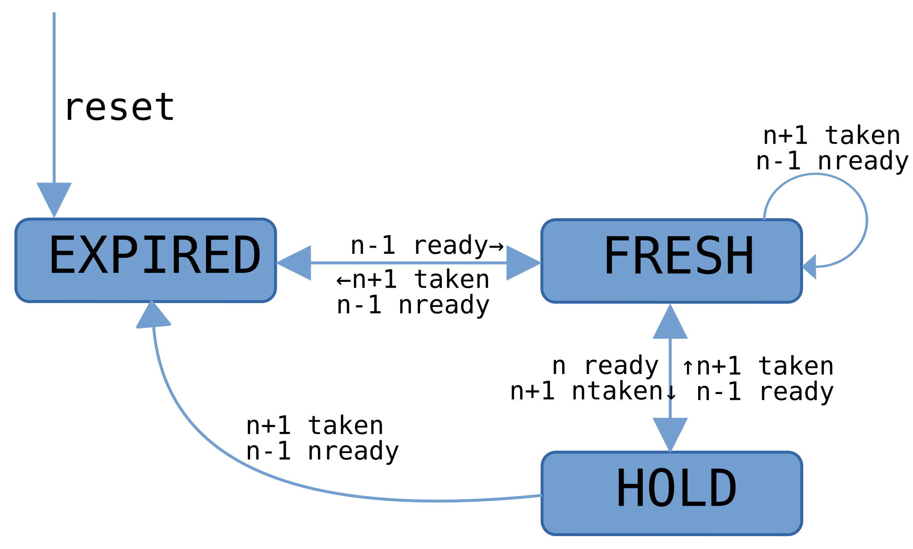
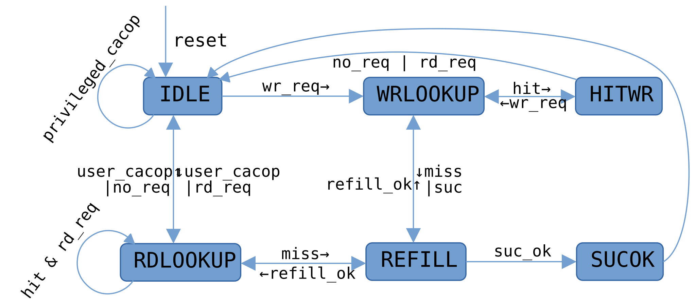

# tiny-loong

一款实现了[LA32R](https://www.loongson.cn/uploads/images/2025032109211238668.%E9%BE%99%E6%9E%B6%E6%9E%8432%E4%BD%8D%E7%B2%BE%E7%AE%80%E7%89%88%E5%8F%82%E8%80%83%E6%89%8B%E5%86%8C_r1p04.pdf)指令集架构的单发射五级流水线处理器核，五级流水线为经典的取指，译码，执行，访存和写回。其还集成了2路组相联的指令数据分离缓存和16项的TLB以及基于BTB，PHT和RAS的简单分支预测器，在CoreMark场景下分支准确率为88.1%。处理器核对外接口为AXI，易于集成。

处理器核在Pango PGL25G FPGA上可以达到45MHz，CoreMark分数为2.34 CoreMark/MHz，软件适配方面与[OpenLA500](https://gitee.com/loongson-edu/open-la500)一致。

## 相关工具链

[la32r-toolchains](https://gitee.com/loongson-edu/la32r-toolchains)
[LoongsonEdu仓库](https://gitee.com/loongson-edu)

## 集成指南

处理器核对外接口为AXI，集成时需将sim_modules下的模块替换为已有ip或其他实现，例如data_bank_ram需替换为相应规格的ram模块。

## 整体架构


## 流水线架构
每级流水线按照本级数据状态分为3种状态，即expired，fresh和hold，语义如下：

>`expired:`表示本级数据已被下级取走但上级数据还未就绪
`fresh:`表示本级数据正在处理或刚处理完毕
`hold:`表示本级数据已就绪但是下级还未准备好取走

状态转换图：


典型转换逻辑如下：
```
case (if_state)
	expired:
		if (new_entry)
			if_state <= fresh;
	fresh:
		if (stall_now)
			if_state <= id_allowin ? expired : hold;
		else  if (if_ready_go)
			if (id_allowin) begin
				if (~new_entry)
					if_state <= expired;
			end  else
				if_state <= hold;
	hold:
		if (id_allowin)
			if_state <= stall_flag ? expired : (new_entry ? fresh : expired);
endcase
```
流水线间使用ready_go，allow_in握手协议，其由流水线状态生成，典型生成逻辑如下（译码级）：
```
assign stall_now = any_excp | id_flush;
assign id_ready_go = is_hold || (is_fresh && (any_excp || src_ok));
assign id_allowin = (is_expired &&  ~stall_flag) || (id_ready_go && exe_allowin);
assign new_entry = if_ready_go && id_allowin;
```

## 缓存架构

缓存采用2路组相联结构，地址分布为VIPT即虚地址index，实地址tag，写回法，随机替换策略，每路256项，每项16字节，分为4个bank，数据指令分离，各8KB。

缓存状态与语义如下：
>`IDLE:`复位状态，可接受请求
`RDLOOKUP:`读请求已接收并进行命中检测以及读出数据(SUC请求总是miss)，若命中则可接收新请求
`WRLOOKUP:`写请求已接收并进行命中检测(SUC请求总是miss)
`HITWR:`写命中，并进行缓存写入，可接收新请求
`REFILL:`miss后重填,重填完成后再次进入RDLOOKUP,WRLOOKUP或SUCOK
`SUCOK:`SUC(Srongly-ordered UnCached强序非缓存)请求完成，可以接收新请求

状态转换图：


## To-do

1.优化部分逻辑，已在代码中使用`//to do`注释标出；
2.完成随机指令验证，操作系统运行验证；
3.规范代码风格；
4.优化资源复用，提高主频；

## 已知问题

本项目未经充分验证，可能存在未知问题。

